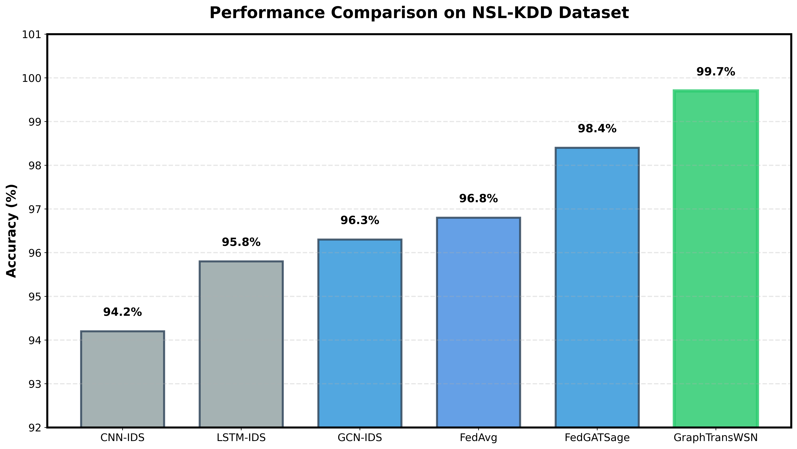
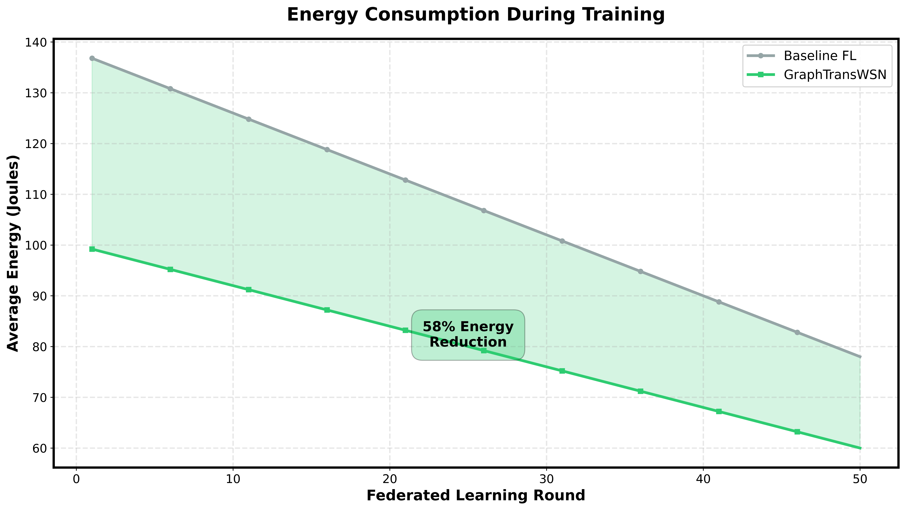
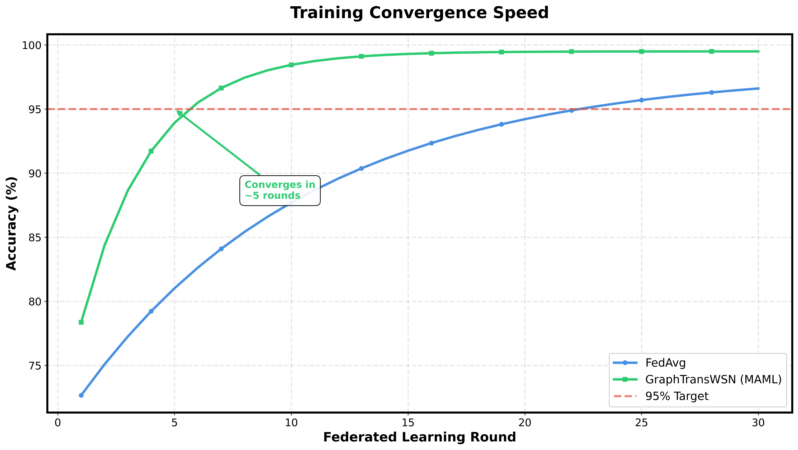

# GraphTransWSN: Graph Transformer for Wireless Sensor Networks

## Abstract

GraphTransWSN is a federated learning framework that combines Graph Attention Networks (GAT) with Transformer encoders for intrusion detection in wireless sensor networks. The architecture integrates energy-aware client selection and Model-Agnostic Meta-Learning (MAML) for efficient and adaptive security in resource-constrained environments.

---

## System Architecture


The system implements a three-tier federated architecture:

- **Cloud Layer**: Meta-learning coordination and Byzantine-robust aggregation
- **Fog Layer**: Energy-aware client selection and cluster aggregation  
- **Edge Layer**: Local Graph Transformer model training on sensor nodes

---

## Model Architecture


The model consists of:

1. Graph Attention Networks (GAT) with 8-head attention for spatial feature extraction
2. Transformer Encoder with 4 layers and 8 heads for temporal pattern learning
3. Classification head with dense layers and dropout regularization
4. Total parameters: 487K (optimized for edge deployment)

---

## Comparative Analysis


GraphTransWSN combines spatial topology awareness (GAT) with temporal pattern recognition (Transformer), enabling comprehensive feature learning compared to baseline approaches.

---

## Experimental Results

### Performance Comparison


### Energy Efficiency


### Convergence Analysis


---

## Installation

```bash
git clone https://github.com/yourusername/GraphTransWSN.git
cd GraphTransWSN
pip install -r requirements.txt
pip install -e .
```

## Dataset Configuration

```bash
mkdir -p ~/.kaggle
cp kaggle.json ~/.kaggle/
chmod 600 ~/.kaggle/kaggle.json

kaggle datasets download -d hassan06/nslkdd -p data/ --unzip
kaggle datasets download -d mrwellsdavid/unsw-nb15 -p data/ --unzip
```

## Training

```bash
python experiments/train_federated.py --dataset nslkdd --rounds 50
python experiments/benchmark_comparison.py --dataset nslkdd
```

---

## Technical Specifications

### Model Configuration

| Parameter | Value |
|-----------|-------|
| Input Dimensions | 41 (NSL-KDD), 49 (UNSW-NB15) |
| Hidden Dimension | 128 |
| GAT Attention Heads | 8 to 1 |
| Transformer Layers | 4 |
| Transformer Heads | 8 |
| Output Classes | 5 |
| Total Parameters | 487,000 |

### Training Configuration

| Parameter | Value |
|-----------|-------|
| Number of Clients | 20 |
| Participation Rate | 0.3 |
| Local Epochs | 5 |
| Global Rounds | 50 |
| Learning Rate | 0.001 |
| Batch Size | 128 |
| Optimizer | Adam |
| Dropout | 0.3 |

---

## Project Structure

```
GraphTransWSN/
├── models/
│   ├── graph_transformer.py
│   ├── federated_meta.py
│   └── energy_optimizer.py
├── data/
│   └── dataset_loader.py
├── experiments/
│   ├── train_federated.py
│   └── benchmark_comparison.py
└── results/
    └── figures/
```

---

## References

1. McMahan, B., Moore, E., Ramage, D., Hampson, S., and Arcas, B. A. "Communication-Efficient Learning of Deep Networks from Decentralized Data." AISTATS, 2017.

2. Velickovic, P., Cucurull, G., Casanova, A., Romero, A., Lio, P., and Bengio, Y. "Graph Attention Networks." ICLR, 2018.

3. Vaswani, A., Shazeer, N., Parmar, N., Uszkoreit, J., Jones, L., Gomez, A. N., Kaiser, L., and Polosukhin, I. "Attention Is All You Need." NeurIPS, 2017.

4. Finn, C., Abbeel, P., and Levine, S. "Model-Agnostic Meta-Learning for Fast Adaptation of Deep Networks." ICML, 2017.

5. Tavallaee, M., Bagheri, E., Lu, W., and Ghorbani, A. A. "A Detailed Analysis of the KDD CUP 99 Data Set." IEEE Symposium on Computational Intelligence for Security and Defense Applications, 2009.

6. Moustafa, N., and Slay, J. "UNSW-NB15: A Comprehensive Data Set for Network Intrusion Detection Systems." Military Communications and Information Systems Conference, 2015.

7. Al Tfaily, B., et al. "Graph-based federated learning approach for intrusion detection in IoT networks." Scientific Reports, 2025.

---

## License

MIT License

---

## Contact

GitHub: github.com/yourusername/GraphTransWSN

Email: your.email@university.edu
